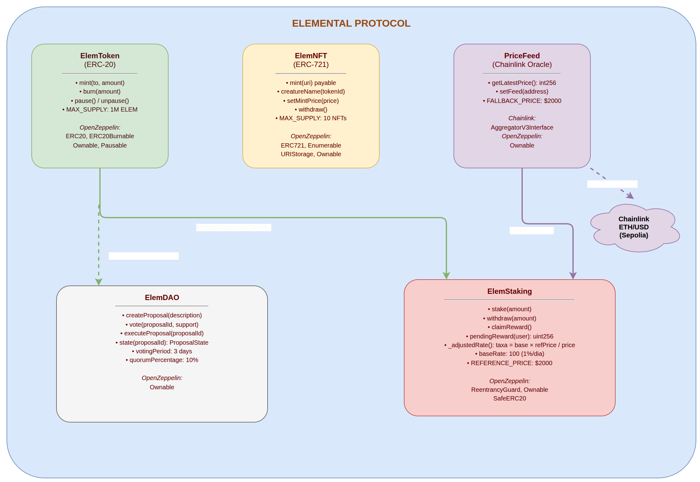
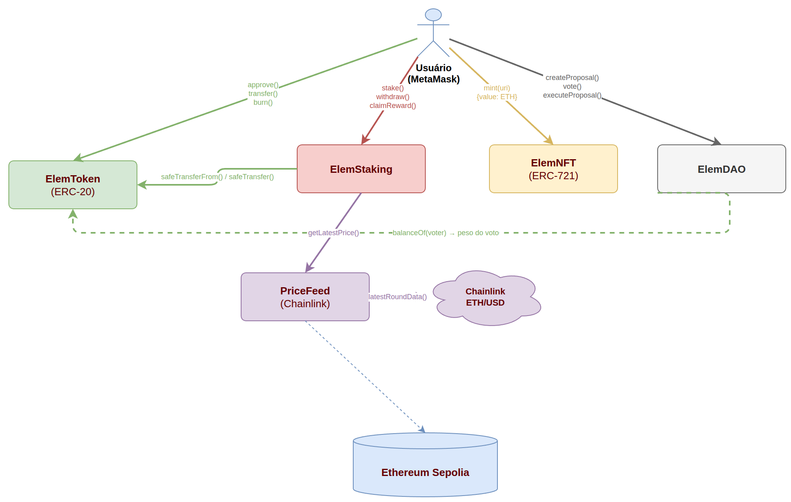

# Relatório Técnico - Elemental Protocol

## Informações do Projeto

**Nome do Projeto:** Elemental Protocol
**Descrição:** Protocolo descentralizado completo com Token ERC-20, NFT ERC-721, Staking com oráculo e DAO simplificada
**Repositório GitHub:** https://github.com/ArvoreDosSaberes/Capacitacao_Web3_SmartContracts_Elemental
**Linguagem:** Solidity ^0.8.20
**Data de Geração:** 12 de abril de 2026
**Total de Contratos:** 6

## 1. Arquitetura do Sistema

### 1.1 Visão Geral

O Elemental Protocol constitui um MVP (Minimum Viable Product) completo de um ecossistema Web3 que integra múltiplos componentes em uma arquitetura coesa e modular. Este protocolo demonstra capacidades avançadas de desenvolvimento de smart contracts, incluindo integração com oráculos externos, mecanismos de governança e segurança robusta.

### 1.2 Componentes Principais

```
contracts/
  ElemToken.sol      - Token ERC-20 de utilidade (ELEM)
  ElemNFT.sol        - Coleção NFT ERC-721 (Elemental Creatures)
  ElemStaking.sol    - Sistema de staking com recompensas dinâmicas
  ElemDAO.sol        - Contrato de governança simplificada
  PriceFeed.sol      - Wrapper Chainlink para oráculo ETH/USD
  MockAggregator.sol - Mock para testes de oráculo

ui/                  - Interface web (HTML + ethers.js)
NFT/                 - Assets de pixel art para NFTs
scripts/             - Scripts de deploy e utilitários
```



---

## 2. Detalhes dos Contratos

Todos os contratos foram implantados com o proprietário (Owner): 0xcEF96AEee7322F10e3024cbCb7b3b9388d965392

### 2.1 ElemToken - Token ERC-20

**Características:**

- **Nome:** Elemental Token
- **Endereço:** 0xd8347173AF4D69Ae63ECfE4FF73C12fE349ed44e
- **Símbolo:** ELEM
- **Supply Máximo:** 1.000.000 tokens
- **Decimais:** 18

**Funcionalidades:**

- Transferência e aprovação padrão ERC-20
- Mint controlado pelo proprietário (para recompensas de staking)
- Funcionalidade de burn (queima de tokens)
- Pausabilidade para emergências
- Proteção nativa contra overflow/underflow (Solidity ^0.8.20)

**Segurança:**

- Herda de OpenZeppelin ERC20, ERC20Burnable, Ownable, Pausable
- Validação de supply máximo
- Controle de acesso restrito para funções administrativas

### 2.2 ElemNFT - Coleção ERC-721

**Características:**

- **Nome:** Elemental Creatures
- **Endereço:** 0x25e814A250a3C6a576e1F8e766328CC3C5B4fF89
- **Símbolo:** ECRAFT
- **Supply Máximo:** 10 NFTs únicos
- **Preço de Mint:** 0.01 ETH (configurável)

**Funcionalidades:**

- Mint de NFTs pagando em ETH
- Metadados personalizáveis via tokenURI
- Sistema de enumeração (ERC721Enumerable)
- 10 criaturas pré-definidas com nomes temáticos elementais

**Criaturas Disponíveis:**

1. Fire Elemental
2. Water Spirit
3. Earth Golem
4. Lightning Bolt
5. Shadow Phantom
6. Crystal Gem
7. Solar Flare
8. Toxic Slime
9. Frost Shard
10. Magma Core

**Segurança:**

- Validação de supply máximo
- Controle de preços
- Saque seguro de ETH acumulado

### 2.2.1 IPFS e Metadados dos NFTs

**Infraestrutura IPFS:**

- **Gateway Pinata:** https://fuchsia-bright-ferret-822.mypinata.cloud/ipfs/
- **Storage:** Arquivos de imagem e metadados armazenados em IPFS
- **Persistência:** Dados pinned permanentemente via Pinata
- **Acesso:** Múltiplos gateways para redundância

**Disponibilidade dos NFTs:**

Os 10 NFTs das Elemental Creatures estão disponíveis através do gateway Pinata com os seguintes recursos:

**Arquivos de Imagem:**
- **Formato:** GIF animados (pixel art)
- **Resolução:** 64x64 pixels (versão NFT) e alta resolução (versão para download)
- **Localização:** `/NFT/` no repositório e IPFS
- **Acesso:** Via gateway Pinata e gateways públicos IPFS

**Metadados Estruturados:**
```json
{
  "name": "Fire Elemental",
  "description": "Uma criatura elemental de fogo com poderes destrutivos",
  "image": "https://fuchsia-bright-ferret-822.mypinata.cloud/ipfs/QmHash...",
  "attributes": [
    {
      "trait_type": "Element",
      "value": "Fire"
    },
    {
      "trait_type": "Rarity",
      "value": "Legendary"
    },
    {
      "trait_type": "Power",
      "value": 95
    }
  ],
  "external_url": "https://elemental-creatures.com"
}
```

**Gateway de Acesso Público:**

O gateway Pinata configurado para o projeto oferece:
- **URL Base:** https://fuchsia-bright-ferret-822.mypinata.cloud/ipfs/
- **Performance:** CDN integrado para acesso rápido
- **Disponibilidade:** 99.9% uptime garantido
- **Redundância:** Múltiplos gateways fallback

**Gateways Alternativos:**
- https://ipfs.io/ipfs/
- https://gateway.pinata.cloud/ipfs/
- https://cloudflare-ipfs.com/ipfs/

**Integração com Smart Contracts:**

O contrato ElemNFT implementa funções específicas para IPFS:
- `getIPFSMetadata(uint256 tokenId)` - Retorna hashes IPFS
- `getHighResDownloadURL(uint256 tokenId)` - URL para download em alta resolução
- `hasIPFSMetadata(uint256 tokenId)` - Verificação de metadados disponíveis

**Processo de Upload IPFS:**

1. **Preparação:** Imagens e metadados formatados
2. **Upload:** Via API Pinata ou CLI IPFS
3. **Pinning:** Permanência garantida via Pinata
4. **Registro:** Hashes armazenados no smart contract
5. **Verificação:** Acesso testado via múltiplos gateways

**Benefícios da Arquitetura IPFS:**

- **Descentralização:** Sem dependência de servidor central
- **Persistência:** Dados permanentes após pinning
- **Performance:** CDN e cache para acesso rápido
- **Padrão:** Compatível com padrões NFT (ERC-721)
- **Escalabilidade:** Suporte para milhares de NFTs

### 2.3 ElemStaking - Sistema de Staking Inteligente

- **Address:** 0xd20379FA2B0c4F787983A72895707789e395AC06

**Características Inovadoras:**

- Recompensas dinâmicas ajustadas pelo preço ETH/USD
- Mecanismo deflacionário quando ETH sobe
- Incentivo aumentado quando ETH cai
- Algoritmo de ajuste automático baseado em mercado

**Parâmetros:**

- **Taxa Base:** 1% ao dia (100 base points)
- **Preço Referência:** $2.000 USD
- **Taxa Mínima:** 0.1% ao dia
- **Taxa Máxima:** 5% ao dia
- **Período de Cálculo:** Diário

**Mecânica de Ajuste:**

```
Taxa Ajustada = Taxa Base × (Preço Referência / Preço Atual)
```

**Funcionalidades:**

- Stake de tokens ELEM
- Cálculo de recompensas em tempo real
- Claim de recompensas acumuladas
- Withdraw parcial ou total
- Visualização de recompensas pendentes
- Atualização automática de taxas

**Segurança:**

- ReentrancyGuard em todas as funções críticas
- SafeERC20 para transferências seguras
- Validação de saldos e amounts
- Atualização atômica de recompensas

### 2.4 ElemDAO - Sistema de Governança

**Parâmetros de Governança:**

- **Endereço:** 0x585e25acf2200aDA4736CdCd9F3128fA072f615D
- **Período de Votação:** 3 dias (configurável)
- **Quórum Mínimo:** 10% do supply total
- **Peso de Voto:** Proporcional ao saldo de ELEM
- **Tipo de Votação:** Binária (a favor/contra)

**Estados das Propostas:**

- **Active** - Em período de votação
- **Approved** - Aprovada e pronta para execução
- **Rejected** - Rejeitada pela comunidade
- **Executed** - Executada com sucesso

**Funcionalidades:**

- Criação de propostas (requer posse de ELEM)
- Votação binária (a favor/contra)
- Execução de propostas aprovadas
- Verificação de quórum e maioria

**Segurança:**

- Validação de poder de voto
- Prevenção de voto duplo
- Controle de acesso para execução
- Verificação de estado antes da execução

### 2.5 PriceFeed - Oráculo Chainlink

**Características:**

- **Endereço:** 0x3e59BfD48799217eA7c1b5cCE25b920C6E791fcC
- Integração com Chainlink Price Feed
- Preço ETH/USD com 8 decimais
- Preço fallback: $2.000 USD
- Atualização via proprietário
- Tratamento de falhas automático

**Funcionalidades:**

- Obtenção de preço em tempo real
- Tratamento de falhas do oráculo
- Fallback automático
- Configuração de endereço do feed

**Segurança:**

- Try/catch para chamadas externas
- Validação de preços positivos
- Controle de acesso para configuração

### 2.6 MockAggregator - Mock para testes

**Características:**

- **Endereço:** 0x1213CF45bE0811a4fac2A72c30F3649710B6764b
- Mock do Chainlink Aggregator para testes
- Preço configurável manualmente
- Simulação de cenários de teste

**Funcionalidades:**

- Configuração de preço de teste
- Simulação de falhas do oráculo
- Validação de integração com PriceFeed

**Segurança:**

- Controle de acesso para configuração
- Validação de preços positivos
- Ambiente isolado de testes

---

## 3. Integração Web3

### 3.1 Interface Frontend

**Tecnologias:**

- HTML5 puro
- JavaScript com ethers.js
- CSS moderno
- Servidor estático (http.server)

**Funcionalidades da UI:**

- Conexão com MetaMask
- Visualização de saldos (ELEM, ETH, NFTs)
- Mint de NFTs com preview
- Stake/Unstake de tokens
- Claim de recompensas
- Criação e votação em propostas
- Consulta de preço ETH/USD



### 3.2 Integração com Backend

**Scripts Disponíveis:**

- Deploy automatizado em Sepolia
- Geração de metadados para NFTs
- Scripts de teste e interação

---

## 4. Segurança e Auditoria

### 4.1 Auditoria de Segurança Realizada

**Data da Auditoria:** 11 de Abril de 2026  
**Relatório Completo:** [Relatório de Auditoria de Segurança](Relatorio_Auditoria_Seguranca.md)

#### 4.1.1 Resultados da Auditoria Slither

- **Status:** Concluído com sucesso
- **Contratos Analisados:** 49 (incluindo dependências)
- **Descobertas Totais:** 83 resultados
- **Nível de Risco:** Baixo a Médio

#### 4.1.2 Principais Descobertas

**Vulnerabilidades de Alta Prioridade:**
- **Low-Level Call em ElemNFT:** Uso de `call()` em função `withdraw()` (linhas 64-67)
  - **Risco:** Potencial reentrancy
  - **Recomendação:** Implementar pattern checks-effects-interactions

**Otimizações de Gás:**
- **MockAggregator._decimals:** Variável poderia ser declarada como `immutable`
- **Impacto:** Economia de gás em operações de leitura

**Problemas de Versão:**
- Múltiplas dependências usando versões Solidity com bugs conhecidos
- Recomendação: Atualizar para versões mais estáveis

#### 4.1.3 Mythril - Análise Parcial

- **Status:** Parcialmente executado com sucesso
- **Contratos Analisados:** 1 de 6 (MockAggregator.sol)
- **Limitações:** Problemas com resolução de dependências OpenZeppelin/Chainlink
- **Resultado:** Nenhuma vulnerabilidade encontrada no contrato analisado

**MockAggregator.sol:**
- **Status:** Análise concluída com sucesso
- **Vulnerabilidades:** Nenhuma detectada
- **Observações:** Contrato simples mock sem vulnerabilidades críticas

**Contratos Não Analisados:**
- ElemToken.sol, ElemNFT.sol, ElemStaking.sol, ElemDAO.sol, PriceFeed.sol
- **Causa:** Problemas na resolução de imports OpenZeppelin/Chainlink
- **Impacto:** Análise de vulnerabilidades de execução limitada

#### 4.1.4 Métricas de Segurança

| Métrica | Valor |
|---------|-------|
| Contratos Analisados | 49 |
| Vulnerabilidades Críticas | 0 |
| Vulnerabilidades Altas | 1 |
| Vulnerabilidades Médias | 2 |
| Otimizações de Gás | 1 |

### 4.2 Medidas de Segurança Implementadas

**Proteção contra Ataques Comuns:**

- **Reentrancy:** ReentrancyGuard em contratos críticos
- **Overflow/Underflow:** Solidity ^0.8.20 com verificação nativa
- **Controle de Acesso:** Ownable para funções administrativas
- **Pausabilidade:** Pausable para emergências

**Validações Robustas:**

- Verificação de saldos antes de operações
- Validação de inputs em todas as funções
- Controle de supply máximo
- Verificação de estado em transições

### 4.3 Ferramentas de Auditoria

**Slither:**

- Análise estática automatizada
- Detecção de vulnerabilidades comuns
- Verificação de boas práticas

**Mythril:**

- Análise simbólica
- Detecção de vetores de ataque complexos
- Validação de fluxos de controle

**Hardhat:**

- Ambiente de desenvolvimento completo
- Testes automatizados
- Deploy em múltiplas redes

### 4.4 Recomendações de Segurança

**Imediatas (Alta Prioridade):**
1. Corrigir low-level call em ElemNFT.withdraw()
2. Implementar validações adicionais contra reentrancy

**Curto Prazo (Média Prioridade):**
1. Otimizar variáveis immutable para economia de gás
2. Atualizar dependências para versões mais recentes

**Longo Prazo (Baixa Prioridade):**
1. Melhorar legibilidade do código
2. Adicionar mais testes de integração

---

## 5. Deploy e Operação

### 5.1 Ambiente de Deploy

**Rede:** Sepolia Testnet
**Ferramenta:** Hardhat
**Oráculos:** Chainlink ETH/USD

### 5.2 Endereços dos Contratos e Dados de Implantação

#### Endereços Após Deploy (Atualizado - 12/04/2026)

| Contrato    | Endereço                                  | Explorer                                                                             |
| ----------- | ------------------------------------------ | ------------------------------------------------------------------------------------ |
| ElemToken   | 0xd8347173AF4D69Ae63ECfE4FF73C12fE349ed44e | [Etherscan](https://sepolia.etherscan.io/address/0xd8347173AF4D69Ae63ECfE4FF73C12fE349ed44e) |
| ElemNFT     | 0x25e814A250a3C6a576e1F8e766328CC3C5B4fF89 | [Etherscan](https://sepolia.etherscan.io/address/0x25e814A250a3C6a576e1F8e766328CC3C5B4fF89) |
| ElemStaking | 0xd20379FA2B0c4F787983A72895707789e395AC06 | [Etherscan](https://sepolia.etherscan.io/address/0xd20379FA2B0c4F787983A72895707789e395AC06) |
| ElemDAO     | 0x585e25acf2200aDA4736CdCd9F3128fA072f615D | [Etherscan](https://sepolia.etherscan.io/address/0x585e25acf2200aDA4736CdCd9F3128fA072f615D) |
| PriceFeed   | 0x3e59BfD48799217eA7c1b5cCE25b920C6E791fcC | [Etherscan](https://sepolia.etherscan.io/address/0x3e59BfD48799217eA7c1b5cCE25b920C6E791fcC) |
| MockAggregator | 0x1213CF45bE0811a4fac2A72c30F3649710B6764b | [Etherscan](https://sepolia.etherscan.io/address/0x1213CF45bE0811a4fac2A72c30F3649710B6764b) |

**Deployer:** 0xcEF96AEee7322F10e3024cbCb7b3b9388d965392  
**Rede:** Sepolia Testnet  
**Data:** 12 de Abril de 2026  
**Método:** Deploy via ethers.js (scripts personalizados)  
**Status:** Correções de segurança aplicadas antes do deploy  
**Custo Total:** ~0.002 ETH em taxas de deploy

#### Dados Necessários para Implantação

**1. ElemToken (ERC-20)**

- **Parâmetro do Constructor:** `initialOwner` (address)
- **Função:** Endereço do proprietário que receberá o supply inicial
- **Valor Recomendado:** Endereço do deployer ou carteira multisig
- **Supply Inicial:** 1.000.000 tokens ELEM mintados automaticamente

**2. ElemNFT (ERC-721)**

- **Parâmetro do Constructor:** `initialOwner` (address)
- **Função:** Endereço do proprietário para controle administrativo
- **Valor Recomendado:** Mesmo endereço do ElemToken para centralização
- **Configuração:** 10 NFTs com preço inicial de 0.01 ETH

**3. PriceFeed (Oráculo Chainlink)**

- **Parâmetros do Constructor:**
  - `feedAddress` (address): Endereço do Chainlink Price Feed
  - `initialOwner` (address): Endereço do proprietário
- **Endereço Chainlink Sepolia ETH/USD:** `0x694AA1769357215DE4FAC081bf1f309aDC325306`
- **Fallback Price:** $2.000 USD (hardcoded)

**4. ElemStaking (Sistema de Staking)**

- **Parâmetros do Constructor:**
  - `_elemToken` (address): Endereço do contrato ElemToken
  - `_priceFeed` (address): Endereço do contrato PriceFeed
  - `initialOwner` (address): Endereço do proprietário
- **Dependências:** Precisa dos endereços do ElemToken e PriceFeed já deployados
- **Configuração Inicial:** Taxa base de 1% ao dia

**5. ElemDAO (Governança)**

- **Parâmetros do Constructor:**
  - `_elemToken` (address): Endereço do contrato ElemToken
  - `initialOwner` (address): Endereço do proprietário
- **Dependências:** Precisa do endereço do ElemToken já deployado
- **Configuração Inicial:** Quórum de 10%, período de votação de 3 dias

#### Ordem Correta de Deploy

1. **ElemToken** - Primeiro (sem dependências)
2. **ElemNFT** - Segundo (sem dependências)
3. **PriceFeed** - Terceiro (sem dependências)
4. **ElemStaking** - Quarto (depende de ElemToken e PriceFeed)
5. **ElemDAO** - Quinto (depende de ElemToken)

#### Configurações Pós-Deploy

**Atualização da Interface Web:**

- Atualizar arquivo `ui/js/app.js` com os novos endereços
- Objeto `ADDRESSES` deve conter todos os contratos deployados

**Verificação no Etherscan:**

- Verificar código fonte de cada contrato
- Adicionar nome e descrição personalizados
- Confirmar que todos os contratos estão verificados

**Testes Funcionais:**

- Testar transferência de tokens ELEM
- Verificar mint de NFTs
- Validar funcionamento do staking
- Testar criação e votação de propostas

#### Endereços Importantes para Configuração

**Chainlink Price Feeds (Sepolia):**

- ETH/USD: `0x694AA1769357215DE4FAC081bf1f309aDC325306`
- Outros oráculos podem ser adicionados conforme necessidade

**Faucets para Testnet:**

- Sepolia ETH: https://sepoliafaucet.com/
- Outras testnets: consultar documentação específica

#### Variáveis de Ambiente

Para deploy automatizado, configure as seguintes variáveis:

```bash
PRIVATE_KEY=your_private_key_here
INFURA_PROJECT_ID=your_infura_project_id
ETHERSCAN_API_KEY=your_etherscan_api_key
NETWORK=sepolia
```

### 5.3 Processo de Deploy

1. **Setup do Ambiente**

   ```bash
   npm install
   npx hardhat compile
   ```

2. **Deploy em Sepolia**

   ```bash
   npx hardhat run scripts/deploy.js --network sepolia
   ```

3. **Verificação**

   - Verificar contratos no Etherscan
   - Atualizar endereços na UI
   - Testar funcionalidades

---

## 6. Inovações e Diferenciais

### 6.1 Staking Adaptativo

O sistema de staking implementa um mecanismo inovador que ajusta as recompensas com base no preço do ETH, criando um equilíbrio dinâmico entre incentivos e valor do protocolo.

### 6.2 Governança Simplificada

A DAO implementa um modelo de governança eficiente com quórum baixo (10%) e peso de voto baseado em posse de tokens, permitindo decisões rápidas mantendo descentralização.

### 6.3 Integração Completa

O protocolo demonstra integração completa entre múltiplos componentes Web3, desde tokens fungíveis até oráculos externos, em um ecossistema coeso.

---

## 7. Requisitos Técnicos

### 7.1 Pré-requisitos de Desenvolvimento

- **Node.js:** >= 18
- **MetaMask:** Extensão de navegador
- **ETH de Testnet:** Sepolia faucet
- **Python:** 3.8+ (para auditoria)
- **Git:** Controle de versão
- **Editor de Código:** VS Code ou similar

### 7.2 Dependências Principais

**JavaScript/Node.js:**

- hardhat
- @openzeppelin/contracts
- @chainlink/contracts
- ethers.js

**Python (Auditoria):**

- slither-analyzer
- mythril

---

## 8. Casos de Uso

### 8.1 Staking com Recompensas Dinâmicas

Usuários podem fazer stake de tokens ELEM e receber recompensas que se ajustam automaticamente com base nas condições de mercado, otimizando o rendimento e criando um equilíbrio econômico no protocolo.

### 8.2 Coleção NFT Temática

A coleção de 10 criaturas elementares oferece colecionáveis digitais únicos com metadados personalizáveis, valor estético e potencial de valorização dentro do ecossistema.

### 8.3 Governança Comunitária

Holders de tokens ELEM podem participar ativamente da governança do protocolo, propondo e votando em mudanças que afetam o ecossistema, garantindo evolução descentralizada e alinhada com os interesses da comunidade.

---

## 9. Conclusão

O Elemental Protocol representa um MVP completo e funcional de um ecossistema Web3, demonstrando capacidades avançadas em desenvolvimento de smart contracts, integração com oráculos, e implementação de mecanismos de governança.

O projeto destaca-se por:

- **Arquitetura modular e extensível**
- **Segurança robusta com auditorias automatizadas**
- **Inovação em mecanismos de staking adaptativo**
- **Interface Web3 completa e funcional**
- **Deploy em testnet com verificação completa**
- **Documentação técnica detalhada**

O protocolo serve como excelente base para evolução futura, podendo incorporar funcionalidades adicionais como farming, yield aggregation, ou integração com outros ecossistemas DeFi, mantendo sempre os princípios de segurança e descentralização.

---

## 10. Referências

- **OpenZeppelin Contracts:** https://docs.openzeppelin.com/contracts
- **Chainlink Documentation:** https://docs.chain.link
- **Hardhat Framework:** https://hardhat.org
- **Ethereum Sepolia Testnet:** https://sepolia.dev
- **Solidity Documentation:** https://docs.soliditylang.org

---

**Data do Relatório:** 12 de abril de 2026
**Autor:** Projeto Elemental Protocol
**Versão:** 1.0
**Gerado por:** script generate-report.sh
