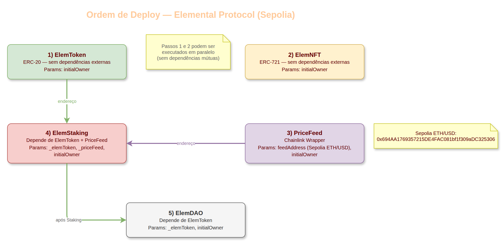
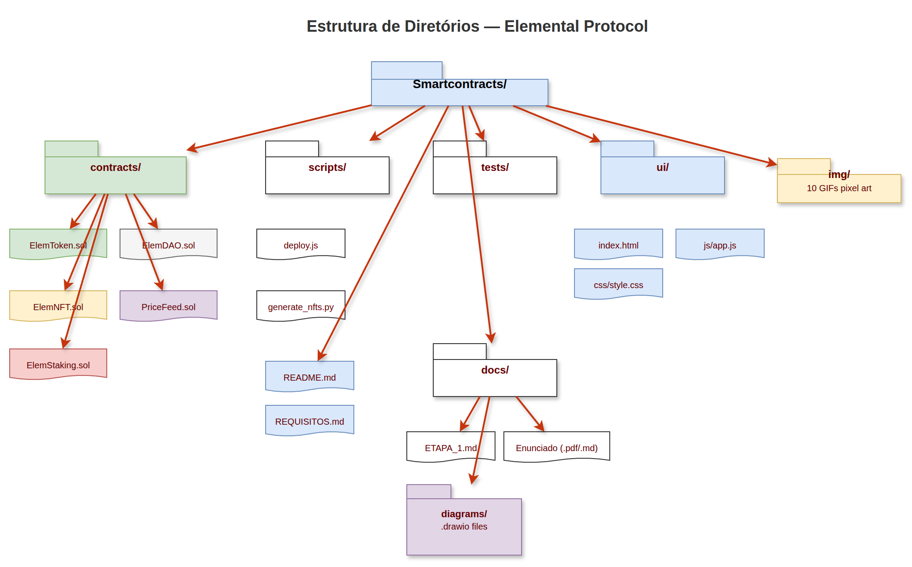

[](https://hits.dwyl.com/ArvoreDosSaberes/Capacitacao_Web3_SmartContracts_Elemental_ETAPA1)


# Etapa 1 – Modelagem

> **Protocolo:** Elemental Protocol  
> **Rede-alvo:** Ethereum Sepolia (testnet)  
> **Solidity:** ^0.8.20  
> **Data:** 27/03/2026

---

## 1. Definição do Problema

### 1.1 Contexto

Ecossistemas Web3 frequentemente sofrem de **fragmentação**: tokens de utilidade, NFTs colecionáveis, mecanismos de staking e governança são implementados como projetos isolados, sem sinergia entre si. Isso gera:

- **Baixo engajamento** — o usuário não tem incentivo para permanecer no ecossistema após adquirir um único ativo.
- **Falta de governança acessível** — decisões sobre o protocolo ficam centralizadas no deployer.
- **Recompensas estáticas** — taxas de staking fixas não respondem às condições de mercado, levando a inflação descontrolada ou a retornos pouco atrativos.

### 1.2 Solução Proposta

O **Elemental Protocol** resolve esses problemas ao integrar, em um único ecossistema gamificado:

| Componente | Função no Ecossistema |
|---|---|
| **Token ELEM (ERC-20)** | Moeda de utilidade: meio de troca, staking, recompensas e peso de voto na DAO. |
| **Elemental Creatures (ERC-721)** | NFTs colecionáveis (pixel art) que representam participação e identidade no protocolo. |
| **Staking com oráculo** | Mecanismo de rendimento dinâmico: a taxa de recompensa se ajusta automaticamente com base no preço ETH/USD via Chainlink, criando um equilíbrio deflacionário/inflacionário. |
| **DAO simplificada** | Governança on-chain onde qualquer holder de ELEM pode criar propostas e votar, com peso proporcional ao saldo. |

### 1.3 Fluxo do Usuário

1. O usuário **conecta a carteira** (MetaMask) à interface web.
2. **Recebe ou adquire tokens ELEM** (distribuição inicial do owner).
3. **Minta NFTs** da coleção Elemental Creatures pagando em ETH.
4. **Faz staking** de ELEM para receber recompensas dinâmicas.
5. **Coleta recompensas** (claim) periodicamente.
6. **Participa da governança** criando e votando em propostas da DAO.

---

## 2. Diagrama de Arquitetura

### 2.1 Visão Geral dos Contratos

> **Diagrama:** [`diagrams/01_visao_geral_contratos.drawio`](diagrams/01_visao_geral_contratos.drawio)  
> Abrir com [draw.io](https://app.diagrams.net) ou extensão *Draw.io Integration* no VS Code.


O diagrama apresenta os 5 contratos do protocolo com suas funções principais, bibliotecas OpenZeppelin utilizadas e as conexões entre eles:

- **ElemToken (ERC-20)** — `mint`, `burn`, `pause/unpause`
- **ElemNFT (ERC-721)** — `mint` (payable em ETH), `tokenURI`, enumerável
- **PriceFeed (Chainlink)** — `getLatestPrice()`, fallback para $2000
- **ElemStaking** — `stake`, `withdraw`, `claimReward`, `_adjustedRate()` (consulta PriceFeed)
- **ElemDAO** — `createProposal`, `vote`, `executeProposal` (consulta `balanceOf` do ElemToken)

### 2.2 Fluxo de Interações entre Contratos

> **Diagrama:** [`diagrams/02_fluxo_interacoes.drawio`](diagrams/02_fluxo_interacoes.drawio)  
> Abrir com [draw.io](https://app.diagrams.net) ou extensão *Draw.io Integration* no VS Code.


O diagrama mostra o fluxo completo de chamadas entre o usuário e os contratos:

- **Usuário → ElemToken:** `approve()`, `transfer()`, `burn()`
- **Usuário → ElemNFT:** `mint(uri)` pagando em ETH
- **Usuário → ElemStaking:** `stake()`, `withdraw()`, `claimReward()`
- **Usuário → ElemDAO:** `createProposal()`, `vote()`, `executeProposal()`
- **ElemStaking → ElemToken:** `safeTransferFrom()` / `safeTransfer()`
- **ElemDAO → ElemToken:** `balanceOf(voter)` para calcular peso do voto
- **ElemStaking → PriceFeed:** `getLatestPrice()` para ajustar taxa
- **PriceFeed → Chainlink:** `latestRoundData()` (oráculo externo)

### 2.3 Ordem de Deploy

> **Diagrama:** [`diagrams/03_ordem_deploy.drawio`](diagrams/03_ordem_deploy.drawio)  
> Abrir com [draw.io](https://app.diagrams.net) ou extensão *Draw.io Integration* no VS Code.



| Passo | Contrato | Dependências | Parâmetros do Constructor |
| ----- | -------- | ------------ | ------------------------- |
| 1 | **ElemToken** | Nenhuma | `initialOwner` |
| 2 | **ElemNFT** | Nenhuma | `initialOwner` |
| 3 | **PriceFeed** | Chainlink ETH/USD (Sepolia) | `feedAddress`, `initialOwner` |
| 4 | **ElemStaking** | ElemToken + PriceFeed | `_elemToken`, `_priceFeed`, `initialOwner` |
| 5 | **ElemDAO** | ElemToken | `_elemToken`, `initialOwner` |

> **Nota:** Passos 1 e 2 podem ser executados em paralelo (sem dependências mútuas).  
> **Endereço Chainlink ETH/USD Sepolia:** `0x694AA1769357215DE4FAC081bf1f309aDC325306`

### 2.4 Estrutura de Diretórios

> **Diagrama:** [`diagrams/04_estrutura_diretorios.drawio`](diagrams/04_estrutura_diretorios.drawio)  
> Abrir com [draw.io](https://app.diagrams.net) ou extensão *Draw.io Integration* no VS Code.



| Diretório / Arquivo | Descrição |
| -------------------- | --------- |
| `contracts/` | Contratos Solidity (ElemToken, ElemNFT, ElemStaking, ElemDAO, PriceFeed) |
| `scripts/` | `deploy.js` (Hardhat) e `generate_nfts.py` (gerador pixel art) |
| `tests/` | Testes unitários e de integração |
| `ui/` | Interface Web — `index.html`, `css/style.css`, `js/app.js` |
| `img/` | 10 GIFs pixel art para os NFTs |
| `docs/` | Documentação, enunciado original (PDF + MD) |
| `docs/diagrams/` | Diagramas draw.io da arquitetura |
| `docs/ETAPA_1.md` | Este documento (Modelagem) |
| `REQUISITOS.md` | Especificação completa do MVP |
| `README.md` | Instruções de uso e deploy |

---

## 3. Justificativa da Escolha dos Padrões ERC

### 3.1 ERC-20 — `ElemToken.sol`

| Aspecto | Justificativa |
|---|---|
| **Por que ERC-20?** | É o padrão mais amplamente adotado para tokens fungíveis na Ethereum. Possui compatibilidade universal com carteiras (MetaMask), DEXes, ferramentas de análise e contratos de terceiros. |
| **Fungibilidade** | O token ELEM é uma moeda de utilidade — cada unidade é intercambiável. Não há necessidade de propriedades únicas por token, o que descarta ERC-721 ou ERC-1155 para este caso. |
| **Extensões usadas** | `ERC20Burnable` (permite queima de tokens para deflação), `Ownable` (controle de acesso ao mint), `Pausable` (circuit-breaker para emergências). |
| **Supply** | 1.000.000 ELEM com cap máximo (`MAX_SUPPLY`). O mint adicional é restrito ao owner, permitindo que o contrato de staking distribua recompensas de forma controlada. |
| **Alternativas descartadas** | **ERC-777** — mais complexo (hooks de recebimento), maior superfície de ataque (reentrância via `tokensReceived`), menor adoção. Para um MVP educacional, a simplicidade e segurança do ERC-20 são preferíveis. |

### 3.2 ERC-721 — `ElemNFT.sol`

| Aspecto | Justificativa |
|---|---|
| **Por que ERC-721?** | Cada NFT da coleção Elemental Creatures é **único** — possui nome, arte (GIF pixel art) e tokenId distintos. O ERC-721 é o padrão nativo para tokens não-fungíveis com identidade individual. |
| **Coleção fixa (10 NFTs)** | A coleção pequena e fixa (`MAX_SUPPLY = 10`) cria escassez e simplifica o escopo do MVP sem perder valor educacional. |
| **Extensões usadas** | `ERC721Enumerable` (permite listar todos os NFTs de um endereço on-chain), `ERC721URIStorage` (metadata flexível por token — IPFS ou on-chain). |
| **Alternativas descartadas** | **ERC-1155** — suporta tokens fungíveis e não-fungíveis no mesmo contrato. Seria apropriado se houvesse múltiplas cópias do mesmo NFT (semi-fungível) ou se quiséssemos unificar ELEM + NFTs em um único contrato. Porém, para uma coleção de 10 itens únicos, o ERC-721 é mais didático, mais legível e possui ecossistema de marketplaces mais maduro (OpenSea, Rarible). |

### 3.3 Resumo Comparativo

| Critério | ERC-20 (ELEM) | ERC-721 (NFT) | ERC-1155 (descartado) | ERC-777 (descartado) |
|---|---|---|---|---|
| **Fungibilidade** | Fungível ✅ | Não-fungível ✅ | Ambos | Fungível |
| **Complexidade** | Baixa ✅ | Média ✅ | Alta | Alta |
| **Compatibilidade** | Universal ✅ | Universal ✅ | Boa | Limitada |
| **Superfície de ataque** | Pequena ✅ | Pequena ✅ | Média | Grande |
| **Adequação ao MVP** | Ideal ✅ | Ideal ✅ | Excessivo | Risco desnecessário |

### 3.4 Padrões de Segurança Adotados

| Padrão / Biblioteca | Contrato(s) | Motivo |
|---|---|---|
| **OpenZeppelin Contracts** | Todos | Implementações auditadas e battle-tested dos padrões ERC. Reduz risco de bugs. |
| **Ownable** | Todos | Controle de acesso simples (owner pode pausar, alterar parâmetros). Adequado para MVP sem hierarquia complexa de roles. |
| **ReentrancyGuard** | ElemStaking | Protege `stake()`, `withdraw()` e `claimReward()` contra ataques de reentrância (padrão checks-effects-interactions reforçado por mutex). |
| **Pausable** | ElemToken | Circuit-breaker: permite congelar todas as transferências em caso de vulnerabilidade descoberta pós-deploy. |
| **SafeERC20** | ElemStaking | Wrapper que verifica retorno de `transfer`/`transferFrom`, protegendo contra tokens que não seguem o padrão corretamente. |
| **Solidity ^0.8.20** | Todos | Proteção nativa contra overflow/underflow (checked arithmetic), eliminando necessidade de SafeMath. |
| **Chainlink AggregatorV3** | PriceFeed | Oráculo descentralizado e auditado. Fallback para preço fixo caso a chamada falhe (`try/catch`). |

---

## 4. Modelo de Dados

### 4.1 ElemToken

```
ElemToken
├── MAX_SUPPLY: 1.000.000 × 10¹⁸ (constante)
├── totalSupply(): uint256
├── balanceOf(address): uint256
└── owner: address (pode mint/pause)
```

### 4.2 ElemNFT

```
ElemNFT
├── MAX_SUPPLY: 10 (constante)
├── mintPrice: 0.01 ETH (configurável pelo owner)
├── _nextTokenId: uint256 (auto-incremento)
├── _tokenNames[10]: string[] (nomes das criaturas)
└── tokenURI(tokenId): string (metadata URI)
```

### 4.3 ElemStaking

```
ElemStaking
├── elemToken: IERC20 (imutável)
├── priceFeed: IPriceFeed (configurável)
├── baseRate: 100 (1% ao dia, base 10000)
├── REFERENCE_PRICE: 2000 × 10⁸ (constante)
├── totalStaked: uint256
└── stakes[address] → StakeInfo
    ├── amount: uint256
    ├── rewardDebt: uint256
    └── lastUpdate: uint256 (timestamp)
```

### 4.4 ElemDAO

```
ElemDAO
├── elemToken: IERC20 (imutável)
├── votingPeriod: 3 days (configurável)
├── quorumPercentage: 10% (configurável)
├── proposalCount: uint256
├── proposals[id] → Proposal
│   ├── id, proposer, description
│   ├── forVotes, againstVotes
│   ├── startTime, endTime
│   └── executed: bool
└── hasVoted[id][address]: bool
```

### 4.5 PriceFeed

```
PriceFeed
├── priceFeed: AggregatorV3Interface (Chainlink)
├── FALLBACK_PRICE: 2000 × 10⁸ (constante)
└── getLatestPrice(): int256
```

---

## 5. Mecanismo de Recompensa Dinâmica

A taxa de recompensa do staking é ajustada em tempo real pelo preço do ETH:

```
taxa_ajustada = baseRate × REFERENCE_PRICE / preço_atual_ETH
```

| Cenário | Preço ETH | Taxa Ajustada | Efeito |
|---|---|---|---|
| ETH em alta | $4.000 | 0.5% ao dia | **Deflacionário** — menos ELEM emitido |
| ETH estável | $2.000 | 1.0% ao dia | **Neutro** — taxa base mantida |
| ETH em queda | $1.000 | 2.0% ao dia | **Incentivo** — mais ELEM para compensar |

**Limites de segurança:** mínimo 0.1% (`10/10000`) e máximo 5% (`500/10000`) ao dia.

---

## 6. Conclusão

A modelagem do Elemental Protocol demonstra um ecossistema coeso onde:

- **ERC-20** é a escolha natural para o token de utilidade fungível (ELEM).
- **ERC-721** é a escolha ideal para NFTs colecionáveis únicos (Elemental Creatures).
- **Chainlink** fornece dados de preço confiáveis e descentralizados para o mecanismo de staking dinâmico.
- **Padrões OpenZeppelin** garantem segurança por meio de código auditado e amplamente utilizado.

A arquitetura modular (5 contratos independentes com interfaces bem definidas) permite teste, auditoria e deploy incremental, seguindo boas práticas de desenvolvimento de smart contracts.
